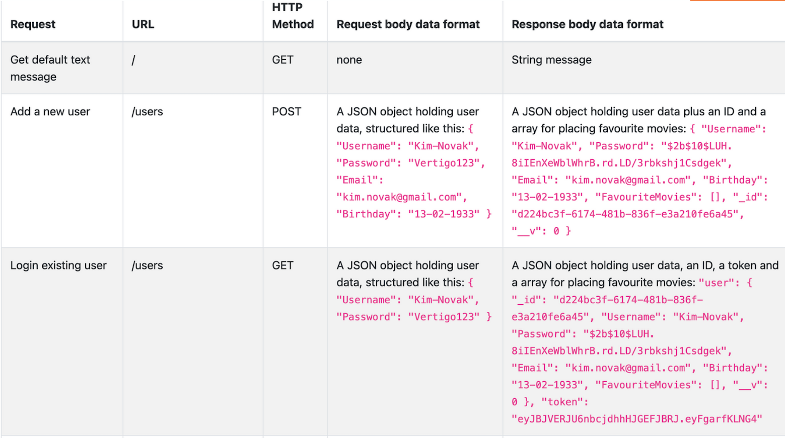

# 📖 movies-api 

 🚀 <a href="https://cineflixxx.netlify.app/">CineFlix App</a>
  
 Link <a href="https://github.com/LoulouLinck/movie_api">movie_api</a>

 

<!-- PROJECT DESCRIPTION -->

**movies-api** is the server-side component of a “movies” web application. This API will provide users with information about different
movies, directors, and genres.

## 🛠 Built With 

### Tech Stack 

The API is a Node.js and Express application that use REST architecture. The database was built using MongoDB and the business logic was modeled with Mongoose.

  
Server

  <ul>
    <li><a href="https://expressjs.com/">Express.js</a></li>
  </ul>

Database

  <ul>
    <li><a href="https://www.mongodb.com/">mongoDB</a></li>
  </ul>

- **The API contains of more than 3 middleware modules
- **The API uses a 'package.json'-File
- **The business logic was modeled with Mongoose
- **The API provides movie information in JSON Format
- **The API includes user authentication and authorisation code
- **The API includes data validation logic
- **The API meets data security regulations
- **The API source code is deployed to a publicly accessible platform
- **The API is deployed with Heroku
<!-- Features -->

### Key Features 

The app allows users to receive information on movies, directors, and genres and to save their favorite movies.

- **Return information about Movies**
- **User registration**
- **Bookmark favorite movies**

## 👥 Author 

**Laure Lincker**

- GitHub: [@LoulouLinck](https://github.com/LoulouLinck)

This was a solo project guided by tutors and mentors from <a href="https://careerfoundry.com/en/courses/become-a-web-developer/">CareerFoundry.</a>

<!-- FUTURE FEATURES -->

## 🔭 Future Features 

Coming up next: client side. I will soon create the frontend that users will interact with. 
